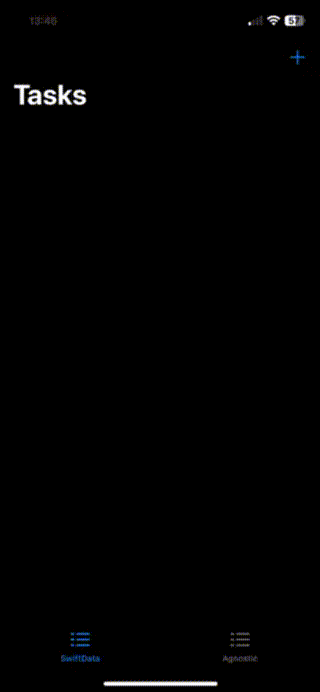

# Agnostic Swift Data
This repository contains a sample iOS application demonstrating a basic to-do task app with a two-tabbed interface. The first tab implements Apple's recommended Swift Data framework, showcasing its integration in a straightforward manner. The second tab isolates database operations within a dedicated module, ensuring that Swift Data is not accessed directly from the view layer.

This repository serves as the foundational code for the accompanying blog post.[Agnostic Swift Data](https://javios.eu/swift/harnessing-nfc-technology-in-your-ios-app/) 

## 🎥 Demo Video

### Check out the app in action!  
  
[Youtube](https://youtube.com/shorts/fc4fXt3z4ho?feature=share)

## Requirements

- **Xcode 15.0 or later**
- **iOS 16.0 or later**
- **Swift 6.0**

